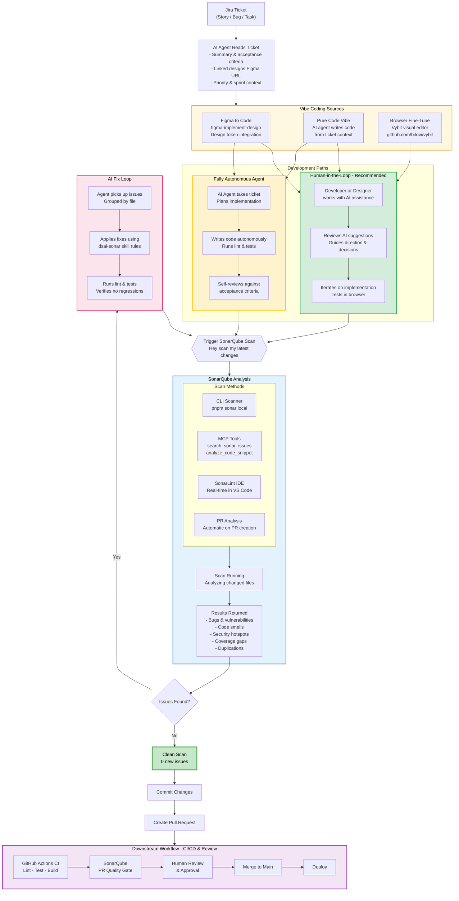

# Vibe Coding Quality Workflow

> Mitigating dev debt introduced by vibe coding through automated SonarQube quality gates and AI-assisted fix loops.

## The Problem

Vibe coding, whether from Figma-to-code, AI agents, or browser-based visual editors - ships features fast but introduces code quality issues and technical debt. This workflow catches and fixes those issues before they reach `main`.

## The Workflow
<!-- [MermaidChart: 5e823f5c-e033-4434-8f11-10dc44074df7] -->

## Key Concepts

### Vibe Coding Sources

| Source            | Description                                                                                         | Quality Risk                                                          |
| ----------------- | --------------------------------------------------------------------------------------------------- | --------------------------------------------------------------------- |
| **Figma to Code** | AI translates Figma designs to React components using `figma-implement-design`                      | Accessibility gaps, non-semantic HTML, missing keyboard nav           |
| **Pure Code Vibe** | AI agent writes code from ticket context (Claude Code, Copilot, etc.)                              | High complexity, magic numbers, deprecated APIs, bracket notation     |
| **Vybit Browser** | Visual fine-tuning in the browser ([GitHub.com/bitovi/vybit](https://github.com/bitovi/vybit))      | Inline styles, hardcoded values, missing design tokens                |

### Two Development Paths

**Human-in-the-Loop (Recommended)**

- Developer/designer drives, AI assists
- Human reviews suggestions, guides decisions
- Best for: complex features, accessibility-critical UI, architectural decisions

**Fully Autonomous Agent**

- AI takes ticket end-to-end
- Self-plans, implements, tests, and reviews
- Best for: repetitive fixes, bulk refactors, test coverage gaps

### SonarQube Scan Methods

| Method             | When                     | How                                                                    |
| ------------------ | ------------------------ | ---------------------------------------------------------------------- |
| **CLI Scanner**    | On demand, pre-commit    | `pnpm sonar:local`                                                    |
| **SonarQube MCP**  | During AI fix loop       | `search_sonar_issues`, `analyze_code_snippet`, `get_component_measures` |
| **SonarLint IDE**  | Real-time while coding   | VS Code extension with connected mode                                  |
| **PR Analysis**    | Automatic on PR          | GitHub Actions triggers scan, decorates PR                             |

### The Fix Loop

The core innovation: instead of shipping debt and fixing later, the AI agent **iterates until clean**:

1. **Scan** - SonarQube analyzes changed files
2. **Triage** - Agent groups issues by file, prioritizes by severity
3. **Fix** - Agent applies fixes using the `dsai-sonar` skill (project-specific rules)
4. **Verify** - Lint + tests confirm no regressions
5. **Re-scan** - Loop back until zero new issues
6. **Ship** - Clean commit, PR, downstream workflow

### How SonarQube Prevents Vibe-Coded Debt from Breaking Code

Vibe-coded output (Figma-to-code, autonomous agents, browser editors) ships features fast but tends to produce high-complexity functions, accessibility gaps, security anti-patterns (bracket notation, unsanitized input), magic numbers, and duplicated strings. Three layers of protection catch these issues before they reach `main`:

**Layer 1: Prevention — `dsai-sonar` Skill**

The `dsai-sonar` skill teaches the AI agent 100+ SonarQube rules *before* it writes code. It covers complexity limits (max 10 cyclomatic, 15 cognitive), security rules (no bracket notation, no prototype pollution), accessibility (semantic HTML, ARIA correctness), React anti-patterns, and testing standards. The agent avoids generating violations in the first place because the rules are loaded into its context at code-writing time.

**Layer 2: Detection & Fix — SonarQube MCP Tools (In-Loop)**

During the fix loop, the agent queries SonarQube directly through MCP tools without leaving the conversation:

| MCP Tool | Purpose |
| --- | --- |
| `search_sonar_issues_in_projects` | Find all new issues on changed files with line numbers and severity |
| `analyze_code_snippet` | Check a code snippet against SonarQube rules *before* committing |
| `get_component_measures` | Query coverage, duplications, complexity metrics per file |
| `get_project_quality_gate_status` | Verify the project would pass the quality gate right now |
| `search_security_hotspots` | Surface security-sensitive code that needs review |

This creates a tight feedback loop: write code, scan, fix, re-scan — all within a single AI session. The agent fixes its own issues rather than shipping them as tech debt.

**Layer 3: Enforcement — PR Quality Gate**

Even after the local fix loop, the PR triggers an automatic SonarQube analysis in CI. This is the hard gate — if new issues slip through, the PR is blocked from merge. This catches anything the local scan missed (e.g., cross-file issues, coverage regressions on the full branch diff).

**Why all three layers matter:**

| Layer | Without It |
| --- | --- |
| Prevention (skill) | Agent generates 10x more issues, fix loop takes longer |
| Detection (MCP) | Issues only surface after PR is pushed — slower feedback, context-switching |
| Enforcement (PR gate) | Local fixes can be skipped or incomplete — broken code reaches `main` |

### Downstream Workflow

Once code passes the quality gate:

1. **GitHub Actions CI** - Lint, test, build across all packages
2. **SonarQube PR Gate** - Final quality gate on the PR branch
3. **Human Review** - Team review and approval
4. **Merge, Deploy**
